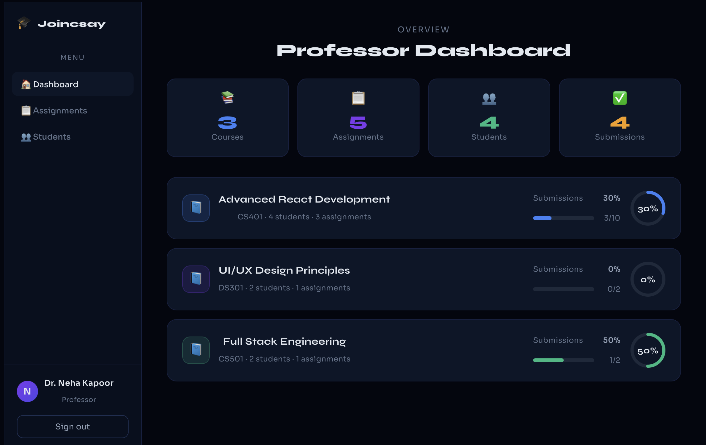
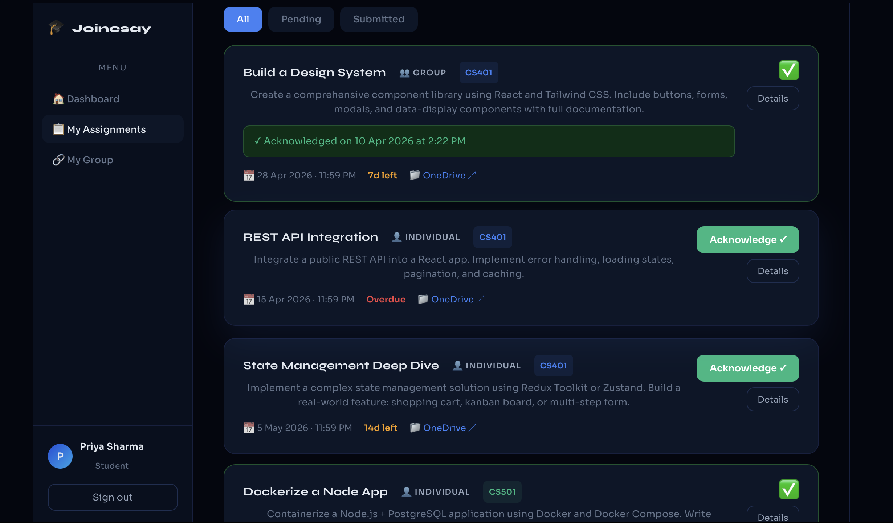

# Assignment Management System (Frontend UI/UX)

## Overview

This is a role-based Assignment Management System built using React.
It supports both Professor and Student workflows with a clean and intuitive UI.
---
## Features

###  Professor Flow

* Login as Professor
* View dashboard with statistics
* Create new assignments
* Track submissions and progress
* View student/group performance

### Student Flow

* Login as Student
* View enrolled courses
* Access assignments
* Submit (acknowledge) assignments
* Group-based submission logic
* Progress tracking with visual indicators

---

## Design Decisions

* Role-based UI rendering (Professor vs Student)
* Component-based architecture for scalability
* Clean and minimal UI for better usability
* Real-time UI updates using React state
* Mock data used instead of backend for simplicity
---
##  Tech Stack
* React.js
* Vite
* JavaScript
* CSS (custom styling)

---

## Project Structure

```
frontend/
 ├ src/
 │ ├ App.jsx
 │ ├ components/
 │ └ styles/
 ├ public/
 ├ package.json
 └ vite.config.js
```

---

## Setup Instructions

```bash
cd frontend
npm install
npm run dev
```

---

## 🌐 Live Demo

https://Akshaya-vanam.github.io/assignment-dashboard

---

##  Screenshots

###  Login Page


### 🎓 Student Dashboard


###  Professor Dashboard


### Assignment 


---

## Future Improvements

* Backend integration (Node.js / Firebase)
* Authentication with JWT
* Database for real-time storage
* Advanced analytics dashboard
